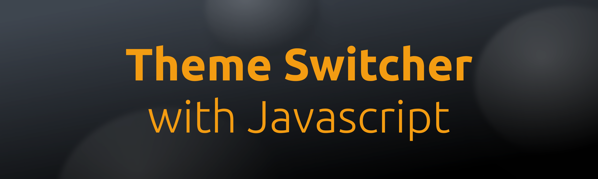
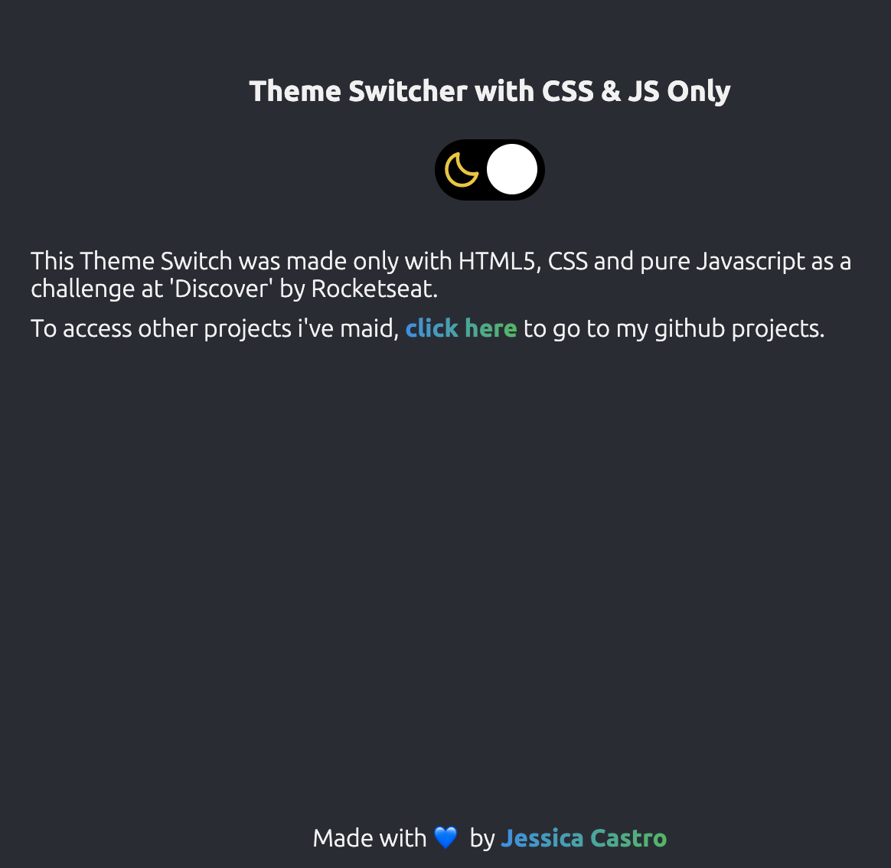
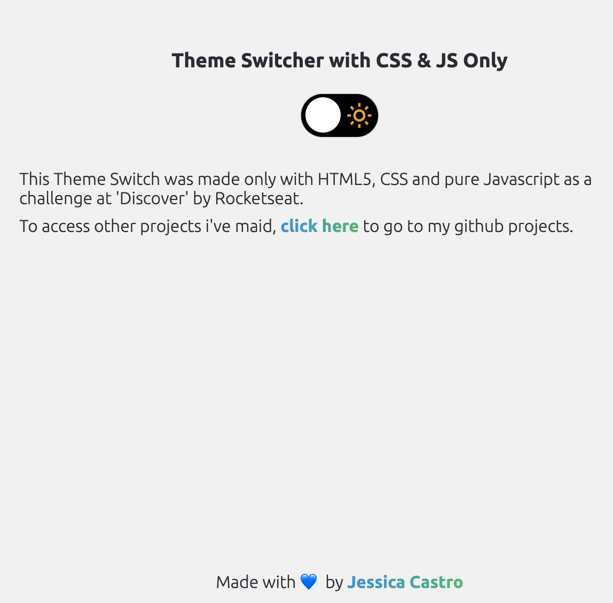

 

<h3 align="center">Theme Switcher</h3>

  Made with HTML, CSS and Javascript.
   

---

###  &#128187; Screens

##### Dark Mode

##### Light mode

###	&#127919; Goals to evolve the idea
- [ ] Get the theme from `localStorage` key `'theme'`.
- [ ] Update to three modes, adding `accessibility` theme.

These objectives, in addition to evolving the application, will make us think about important things such as accessibility and obtaining data from the user's browser (`localStorage` or configs).

Made by 👩🏾‍💻 <a href="https://linkedin.com/in/jessicacastros">Jessica Castro</a> with 💙
